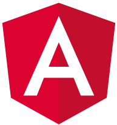
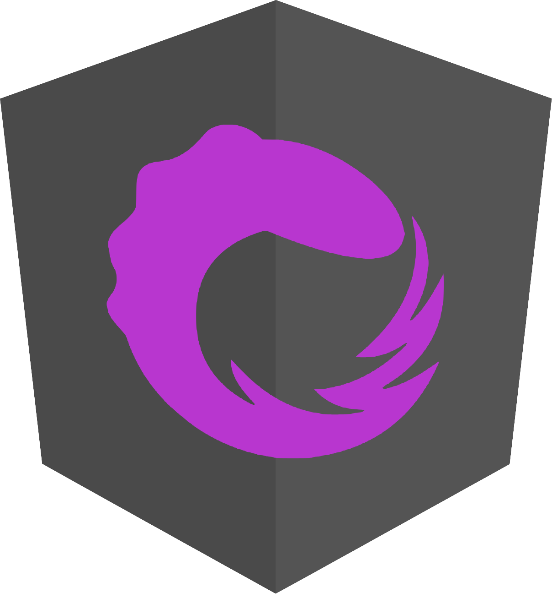
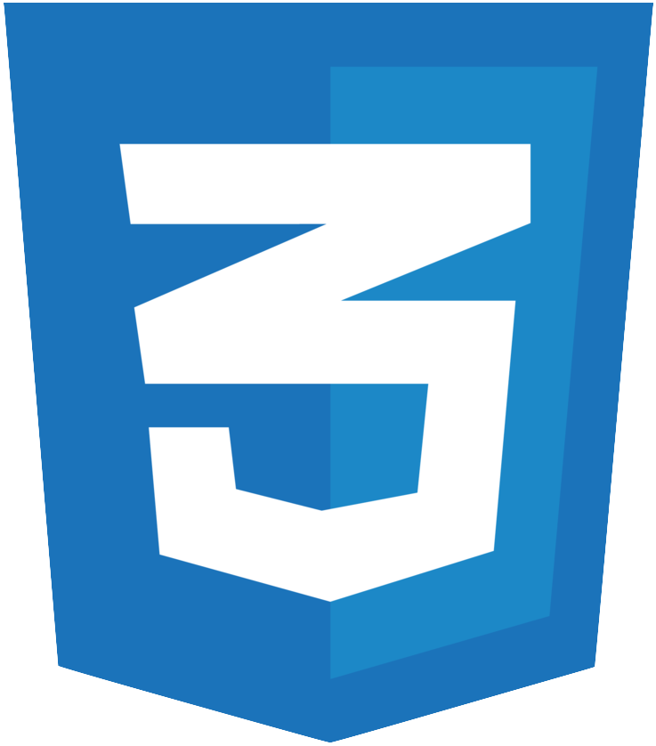
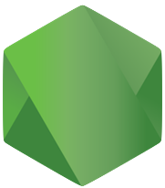
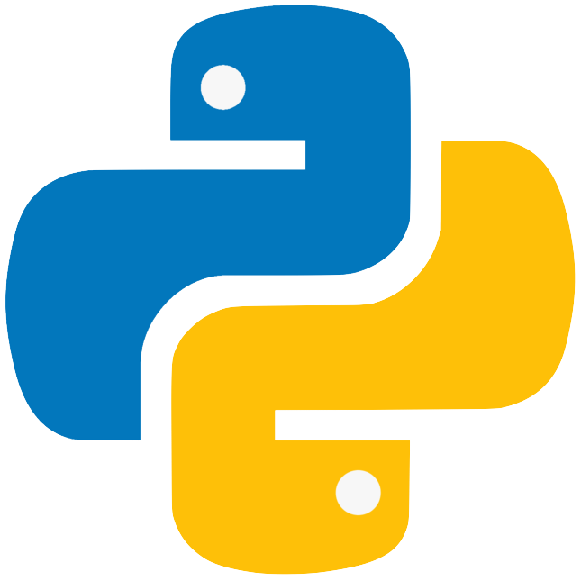

### Hi there 👋 I'm Steve

I'm a software developer in Vancouver, B.C. ⛰ I like to code  but I also like candy 🍬

- 🔭 I’m currently working at [MDA](https://www.mdacorporation.com/) on the [Triton](https://www.prnewswire.com/news-releases/mda-to-provide-maritime-command-and-control-solution-to-nato-665650633.html) Project 🛥. 
- 🌱 I’m currently taking Wes Boss' [Beginner Javascript](https://github.com/quicklikerabbit/beginner-javascript) course to brush up on my fundamentals. 
- 🌱 I’m also doing a [Python course](https://github.com/Pierian-Data/Complete-Python-3-Bootcamp) with Udacity. 
- 💬 Ask me about [OpenLayers](https://github.com/openlayers/openlayers)🌎   or [Angular](https://github.com/angular/angular).
- 📫 Email me at [steve@syncline.ca](mailto:steve@syncline.ca) or hit me up on Twitter [@quicklikerabbit](https://twitter.com/quicklikerabbit) 🦜 or [LinkedIn](https://www.linkedin.com/in/sdrpengmeng/) 💼

#### Languages and Tools: 

